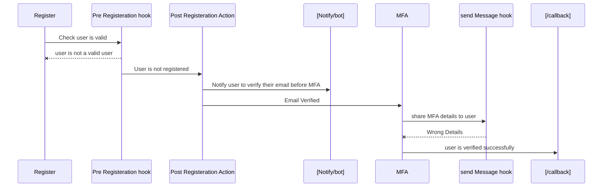

**User Authentication Setup**
You need to setup your authentication using [Auth0](https://auth0.com/)
**Setp-1**
Create a account in Auth0
**Step-2**
After creating your account please click do some stepup
**Step3**
Add 2 Hook for Authentication
one is for sending messages and another for pre-registration. sending message hook sends the OTP to the user during phone number verification and updates user_metadata and pre-registration hook is to check that if the user is previously register or not. if user is not register then user can proceed for registeration and if the user is register then they can't proceed with the email address which they are registered with previously
**Step4**
Add a post registration action
Post registration Action is used to check that user is verfied or not if user is not verified then it will send a message to your endpoint.

