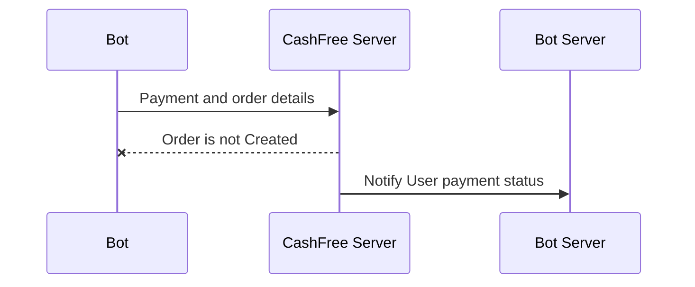

***Set Up Payment GateWay***

For Payment Gateway we are going to use [Cashfree](https://www.cashfree.com/payment-gateway-india/)
***Step-1***

Create a cashfree account 

**Step-2**

Switch to testing environment

** Step-3 **

Follow the [documentation](https://docs.cashfree.com/reference/pg-new-apis-endpoint) to know more

